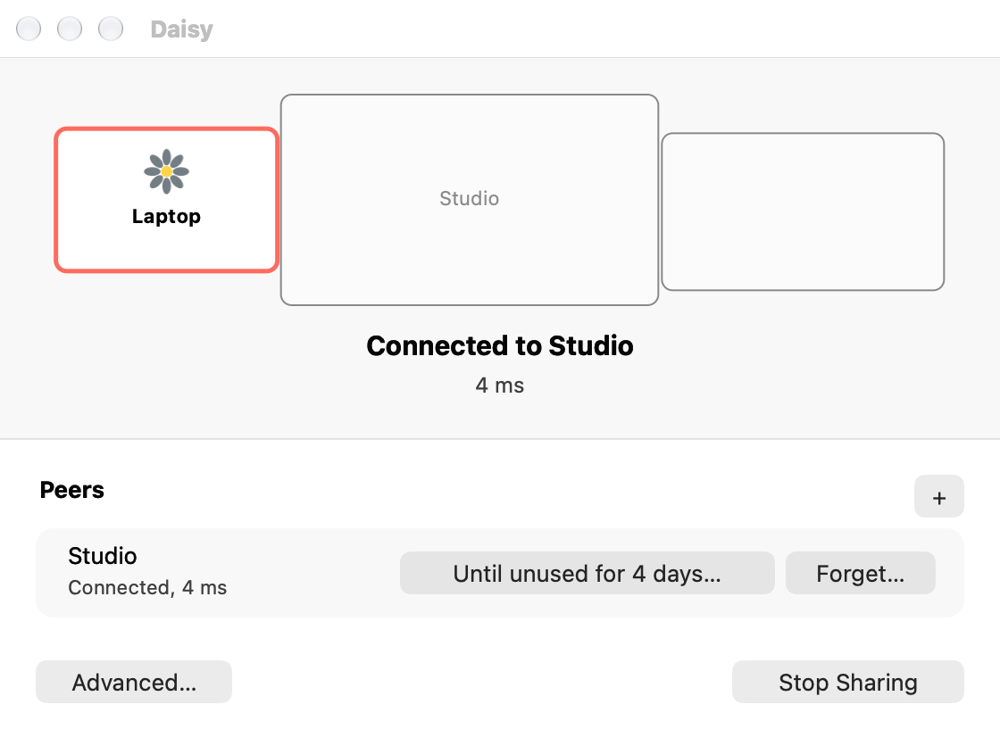

# Getting started

Use two Apple silicon systems running macOS 26 or later, on the same network.

## Install

[Download Daisy](https://github.com/misfitdev/daisy/releases/latest), open the DMG and drag Daisy into Applications on both systems. You can also [install with Homebrew](usage.md#homebrew).

## Start

Open Daisy on both systems. Follow its walkthrough to allow **Accessibility** and **Input Monitoring** in System Settings. Click **Reopen Daisy** if prompted, then **Start Sharing** on both.

Input goes only to paired systems, encrypted in transit. [Manage trust](trust.md) explains the access pairing grants.

## Pair

One system shows a six-digit code. Enter it on the other and click **Connect**. The window title becomes **Connected**. Daisy reconnects automatically while both systems are sharing and still trust each other.

## Make your first crossing

Drag the peer's displays in Daisy to match your desk. Move the pointer off a display toward the peer's display; your keyboard follows it. Cross back to return.

To take control back immediately, press **Control-Option-Command-Escape** on the system you are at.

## If setup stalls

- [Systems keep looking](troubleshooting.md#systems-keep-looking): try a direct address.
- [Permissions remain denied](troubleshooting.md#permissions-remain-denied): reopen the permission walkthrough.
- [A new peer is refused](troubleshooting.md#a-new-peer-is-refused): open pairing on a group member.

After your first crossing, use the [task index](README.md) to find other things you can do.
